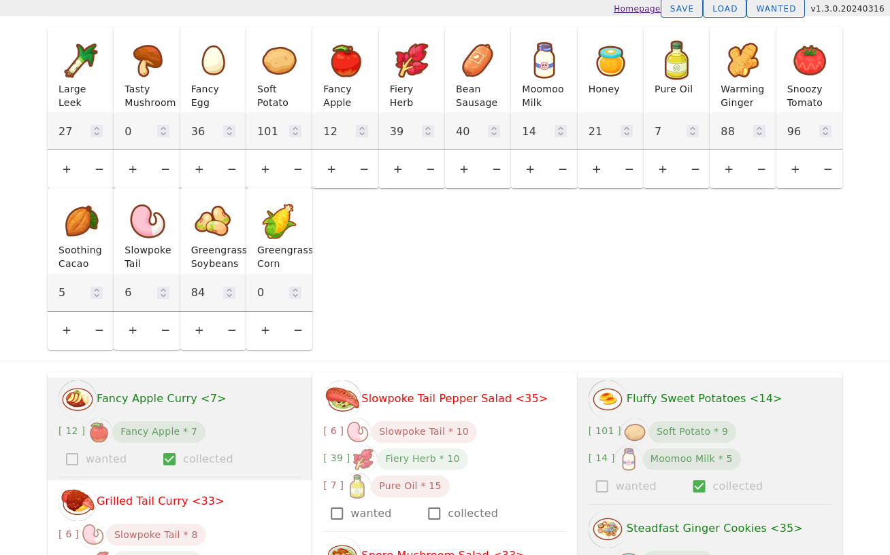
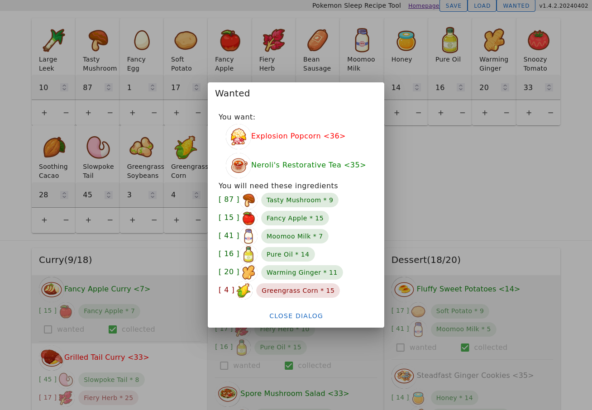

# Pokemon Sleep Recipe Tool

This is a tool that make it easier to track your Pokémon Sleep Recipe Collections.

_This project is still **WIP** and may change a lot._

## Demo

<https://server2.catscarlet.com/demo/pokemon-sleep-recipe-tool/>

## Screenshot






## How to use

Input your ingredient info and this tool will show you which recipes you can make and which you cannot yet.

You can click the save button to save your ingredient info into your [Browser's LocalStorage](https://en.wikipedia.org/wiki/Web_storage). Click the load button and your saved ingredient info will be loaded.

## Todos

1. Pot size filter and Sunday feature.
2. ~~Learned and Wanted filter~~. (Collected filter done in 1.0.6.20230908)(Wanted filter prototype done in 1.0.6.20230911)
3. Ingredient source informations.
4. Better Typography.
5. Mobile Compatibility.
6. Internationalization Support.
7. Filter checkbox keyboard tabindex support. Related to a vuetify issue: vuetifyjs/vuetify#18223

## Development

### Setup

```
# yarn
yarn
```

### Compiles and hot-reloads for development

```
# yarn
yarn dev
```

### Compiles and minifies for production

```
# yarn
yarn build
```
